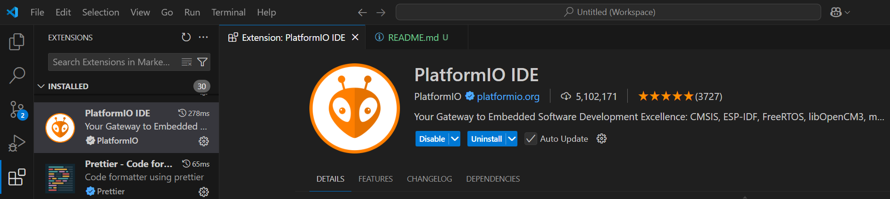
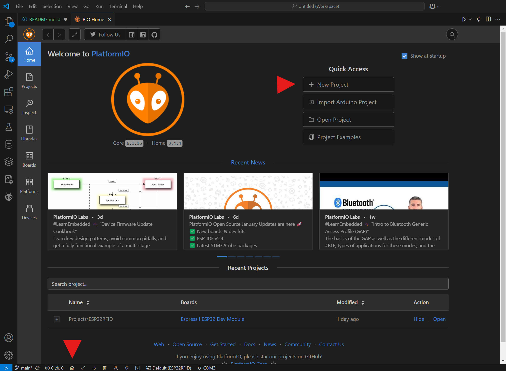
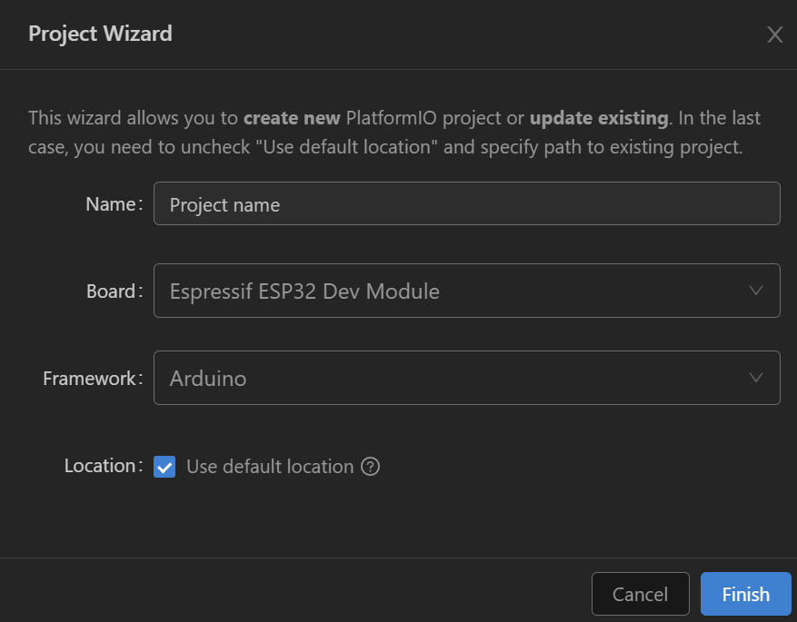
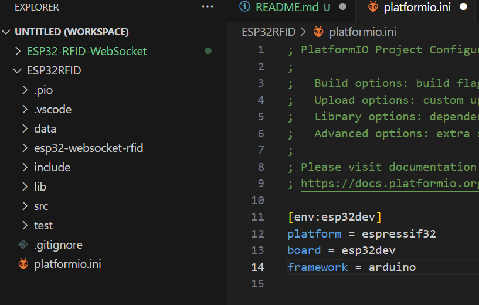
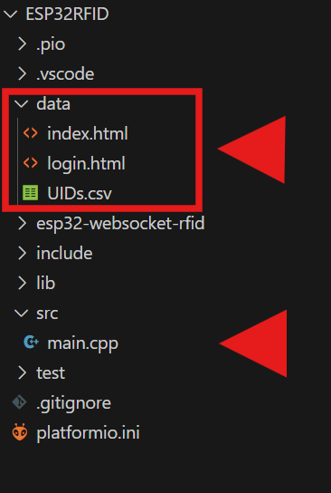
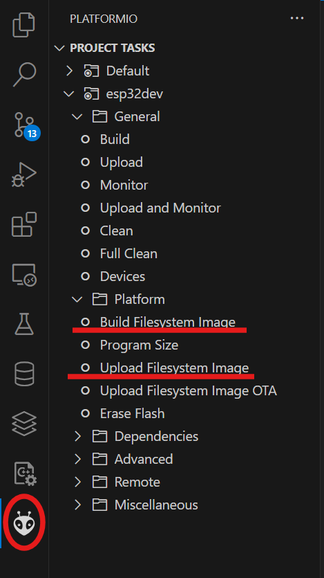
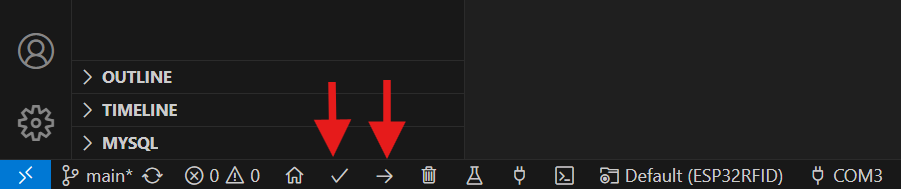

# How to install

### What do we need?
1. Arduino IDE 2.x
2. Visual Studio Code (https://code.visualstudio.com/)
3. The Visual Studio Code extension PlatformIO.
4. The correct partition.csv file for the Arduino Nano ESP32.

### Let's start:
1. Download and install the Arduino IDE 2.x (https://www.arduino.cc/en/software). We need that for the partition.csv file later.

2. Download and install Visual Studio Code (https://code.visualstudio.com/). This will be our main IDE to generate the image and also to create our sketches.

3. After installing Visual Studio Code, install the extension PlatformIO. PlatformIO will also install C/C++ for you.

4. Open the PlatformIO Home and create a new project.

5. Give your project a name and select the Arduino Espressif ESP32 Dev Module board. Framework Arduino and hit finish.

6. After a while, you should see the following screen and the content of the platform.ini file.

### How to use
1. Place the platform.ini file located on my GitHub into your project.
2. Place the ESP32.cpp file located on my GitHub into your project's src folder.
3. Create a folder named data and place the .csv and HTML files from my GitHub into your project's data folder.

4. Click the little alien icon on the left and then select Build Filesystem Image. PlatformIO is building the Filesystem Image based on our data folder.
5. After that, click Upload Filesystem Image. This will take a while.

6. Finally, upload the code to your board. Click the right arrow icon in the bottom menu. If you are not sure, use the first keypad first to confirm the code works.

### ***If you are editing files in the data folder, simply performing steps 4-5 will suffice. Step 6 is not required. Similarly, if you are editing files in src, you do not need to perform steps 4-5, just proceed with step 6.***